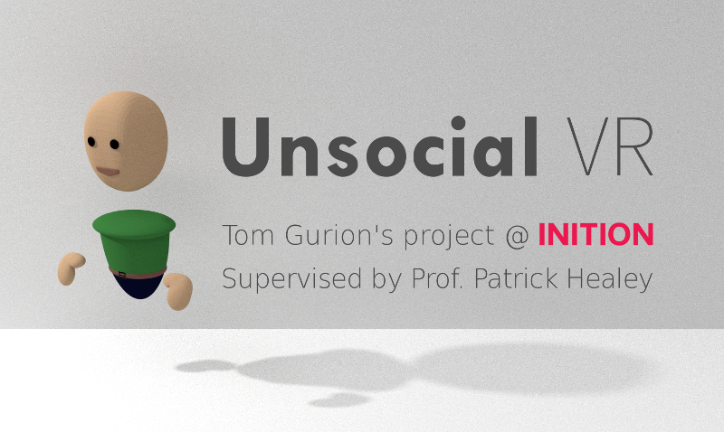

Advanced Placement Project, Media and Arts Technology doctoral programme, Queen Mary University of London. Supervised by Prof. Patrick Healey and hosted at Inition.

## What?

In Infinite Jest, David Foster Wallace argues that "Good old traditional audio-only phone conversations allowed you to presume that the person on the other end was paying complete attention to you while also permitting you not to have to pay anything even close to complete attention to her." He continues and claims that we are addicted to this illusion, and that's why video conferencing always feel so awkward - we need to pretend to listen all the time. And if we think about it, even in face to face conversation we must always adhere to these social rules, and signal our complete attention when someone is talking to us.

In this project I experiment with VR technologies to see if this illusion of faking active listening is transferable to other mediums, and if so, how. In Unsocial VR participants share the same virtual environment, using the HTC Vive headset and controllers. They can converse freely and move around, and if you want to start faking listening to the conversation and just wander around, or even talk with other participants while faking, you absolutely can! The interface is very minimal, just hit a button on the controller to start faking active listening behaviours towards your current conversation, and release it when you want to stop faking. You will even get an on screen notification when someone is speaking directly to you, so you can return to the conversation elegantly.

There are some extra details [on my site](http://www.tomgurion.me/unsocial-vr.html) and a video presenting the project [here](https://youtu.be/tqbtOL5R4fw).

## Running the project

Make sure you have:

- HTC Vive
- Unity 2018.3.0f2.
  - Dissonance Voice Chat 6.2.6. You will need to buy it from the assets store.
- python 2.7
- PureData 0.48.1.
- blender (2.79b is known to be working, but it shouldn't realy matter).

How to run:

1. Clone the project with `git clone --recursive https://github.com/Nagasaki45/UnsocialVR.git`
1. Prepare your credentials from IBM Watson (free trials are available):
    - Visit the [IBM Watson projects](https://console.bluemix.net/developer/watson/projects) page.
    - Choose your project.
    - Copy the credentials to `path/to/UnsocialVR/deep_disfluency_server/credentials.json`.
1. In a separate terminal run the deep_disfluency_server with `cd deep_disfluency_server && pipenv run python server.py`.
1. Open the `backchannels/server_WardTsukahara2000.pd` PureData patch.
1. Open Unity and load the project.
1. Import the Dissonance Voice Chat with its HLAPI adapter.
1. Run!

### PureData Ward & Tsukahara server note

This TCP server can serve only one client at a time. If you are running multiple clients on the same machine (with the Simulator scene, for development/debugging), go to the `Player.prefab` and change the port to something else. Create another copy of the Pd patch and update the port there as well. No build the project and you have a new client and a new server that work with their own port. Make sure not to commit these changes into version control!

### Deep disfluency server note

If you don't need it, or don't have enough "free minutes" on your IBM Watson plan, use the `deep_disfluency_mock.py` script. It will spin a TCP server that will consume the audio stream and do nothing about it.

### Enable and disable avatar automation and automation detection

The system currently support two types of studies. One in which there's no automation and no detection (pilot study, or study 3), and one with automation and detection (study 4). To disable automation and detection:

- Turn off Player/Local/Head/UIPlane.
- Turn off the PlayerDetects script on Player/Local.
- Check the PlayerAutomation.disabled on Player/Remote.
